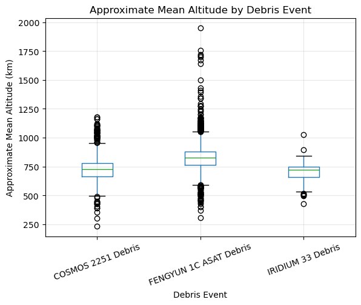
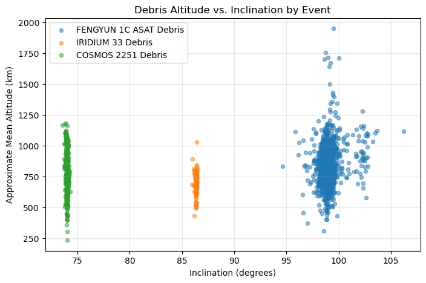
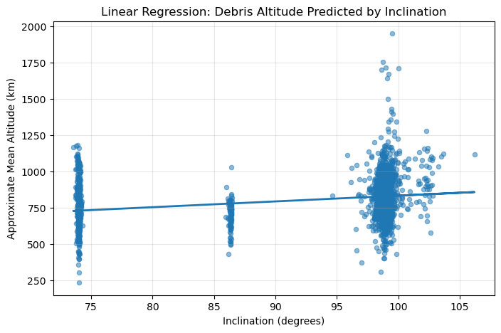

# Orbital Debris Population Structure

A small exploratory data-analysis project using current **CelesTrak General Perturbations (GP)** catalog data for three major debris-producing events:

- FENGYUN 1C ASAT debris
- IRIDIUM 33 debris
- COSMOS 2251 debris

The project grew out of introductory engineering data-analysis coursework and applies that workflow to a space-domain topic of personal interest.

## Research question

**Do major debris-producing events occupy distinct altitude–inclination regimes, and how much of the observed altitude structure can be explained by inclination alone?**

## What the notebook does

1. Downloads current CelesTrak GP data.
2. Cleans the orbital-element fields used in the analysis.
3. Derives:
   - orbital period,
   - semi-major axis,
   - an approximate mean-altitude proxy.
4. Computes descriptive statistics and correlations.
5. Visualizes altitude and inclination structure by debris event.
6. Uses a bootstrap example to illustrate uncertainty in a sample mean.
7. Fits a simple linear regression using inclination.
8. Adds debris-event identity to test whether event membership captures additional structure.
9. Documents limitations of the interpretation.

## Key equations

From mean motion \(n\) in revolutions/day,

$$
T_{\mathrm{min}}=\frac{1440}{n}.
$$

After converting mean motion to rad/s,

$$
a=\left(\frac{\mu}{n^2}\right)^{1/3},
$$

and the notebook defines

$$
h_{\mathrm{approx}}=a-R_E.
$$

$h_{\mathrm{approx}}$ is a semi-major-axis-based **mean-altitude proxy**, not instantaneous altitude, perigee, or apogee.

## Cached snapshot results

The notebook currently contains cached outputs from the data pull used during development:

- 2,646 cataloged objects
- mean approximate altitude: 804.5 km
- median approximate altitude: 804.0 km
- inclination–altitude correlation: 0.294
- inclination-only regression: R² = 0.0866
- inclination + event regression: R² = 0.1138

The main interpretation is that **inclination alone is a weak predictor of the observed altitude structure**. Adding debris-event identity improves the model slightly, consistent with the idea that different debris-producing events occupy different orbital-population regimes.

## Example figures

### Altitude by debris event



### Altitude vs. inclination



### Simple linear regression



## Important limitations

- This is the **current cataloged surviving population**, not the debris distribution immediately after each breakup.
- Atmospheric drag, orbital perturbations, reentry, and catalog maintenance have changed the populations over time.
- Approximate altitude is derived from semi-major axis.
- The regression is descriptive, not causal.
- The notebook does not perform orbit propagation, lifetime prediction, conjunction analysis, or breakup reconstruction.
- CelesTrak's current GP data change over time, so re-running the notebook may change the object count and numerical results.

## Repository structure

```text
orbital-debris-eda/
├── README.md
├── requirements.txt
├── .gitignore
├── notebooks/
│   └── orbital_debris_eda.ipynb
├── src/
│   └── orbital_debris_eda.py
├── figures/
│   ├── altitude_distribution.png
│   ├── altitude_by_event.png
│   ├── altitude_vs_inclination_by_event.png
│   ├── period_vs_altitude.png
│   ├── altitude_normal_fit.png
│   ├── altitude_qq_plot.png
│   ├── linear_regression.png
│   └── regression_residuals.png
└── data/
    └── README.md
```

## Run locally in VS Code

### 1. Create a virtual environment

Windows PowerShell:

```powershell
python -m venv .venv
.venv\Scripts\Activate.ps1
```

### 2. Install dependencies

```powershell
python -m pip install --upgrade pip
pip install -r requirements.txt
```

### 3. Open the notebook

Open:

```text
notebooks/orbital_debris_eda.ipynb
```

Select the `.venv` Python kernel in VS Code and run the notebook from top to bottom.

An internet connection is required when re-running because the notebook downloads current CSV data from CelesTrak.

## Data source

CelesTrak current GP element sets:

- https://celestrak.org/NORAD/elements/gp.php?GROUP=fengyun-1c-debris&FORMAT=csv
- https://celestrak.org/NORAD/elements/gp.php?GROUP=iridium-33-debris&FORMAT=csv
- https://celestrak.org/NORAD/elements/gp.php?GROUP=cosmos-2251-debris&FORMAT=csv

## Tools

- Python
- Jupyter
- pandas
- NumPy
- Matplotlib
- SciPy
- scikit-learn

## Project scope

This is an introductory exploratory analysis, not an operational SSA or conjunction-assessment tool.
